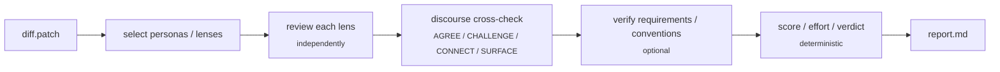
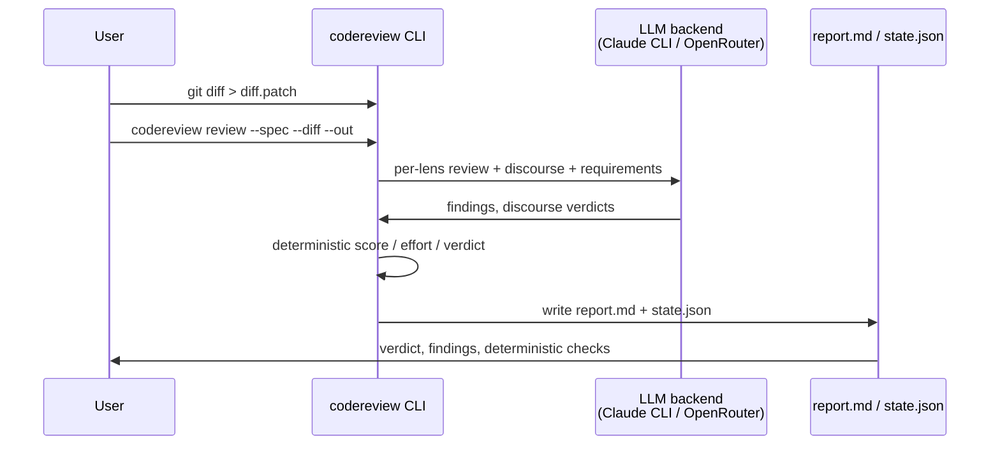
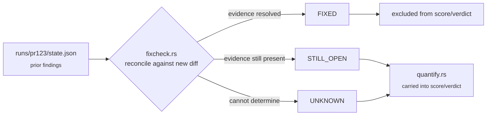
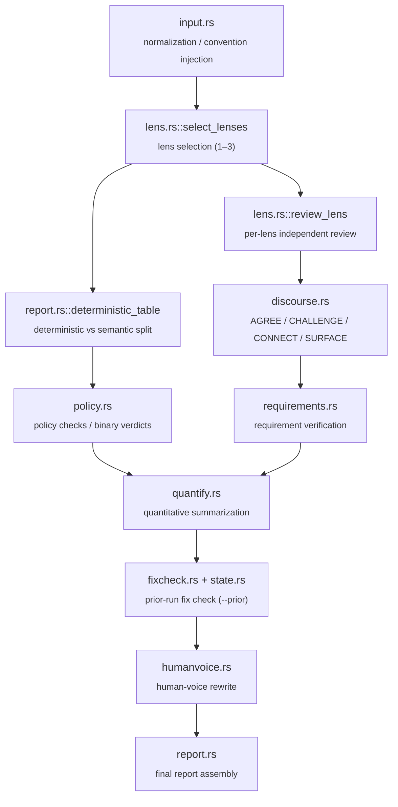
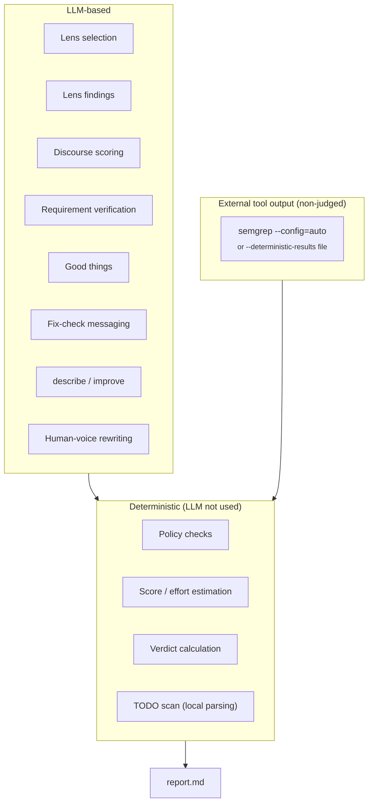
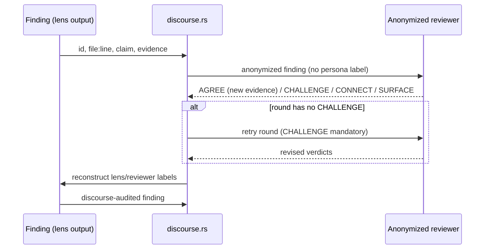

# Code-Review-Loop

A deterministic-first, persona-based review CLI for PR diffs, written in Rust.

`Code-Review-Loop` runs each PR diff through a structured pipeline: multiple expert
personas review the diff independently, cross-check each other's findings through
an anonymized discourse round, and a local deterministic layer — not the LLM —
computes the final score, effort estimate, and pass/fail verdict.

Default LLM backend is Claude Code CLI (`claude -p --output-format json`); an
OpenRouter backend (`--backend openrouter` + `OPENROUTER_API_KEY`) is also available
and does not require the `claude` CLI.

## Pipeline overview



## What this repository is for

This CLI is designed for PR-level review and post-review remediation checks.

- `review` : full PR pipeline (primary mode)
- `describe` : generate PR summary metadata (`title`, `summary`, walkthrough, labels)
- `improve` : produce concrete patch suggestions with before/after code snippets

It favors traceability and auditability:

- deterministic checks are locally computed,
- LLM output is limited to judgmental parts, and
- fixed schemas keep outputs reviewable by scripts.

## Build and requirements

### Requirements

- Rust toolchain (for building the CLI)
- `claude` CLI in PATH (for LLM-backed review modes, default backend) —
  or `--backend openrouter` with `OPENROUTER_API_KEY` set, which needs no `claude` CLI
- optional: `semgrep` for local deterministic SAST/secrets/semi-static checks

### Build

```bash
cargo build --release

# Built binary:
# target/release/codereview
```

If you want to keep a local debug binary:

```bash
cargo build
```

## Core usage

All commands expect a diff patch and a spec file.

```bash
git diff > diff.patch
```

### `review` (primary pipeline)

```bash
codereview review \
  --spec specs/default.toml \
  --diff diff.patch \
  --requirements requirements.md \
  --conventions conventions.md \
  --deterministic-results deterministic-results.json \
  --human-voice \
  --out runs/pr123
```

`requirements`, `conventions`, and `deterministic-results` are optional.
If omitted, the tool emits explicit "not provided" sections rather than inventing assumptions.



Output (normally under `runs/pr123`):

- `report.md`: verdict, policy checks, quantitative summary, requirements/conventions,
  findings, good things, deterministic checks, and discourse audit
- `state.json`: review state snapshot used by `--prior`

### `--prior` (re-review after patching)

```bash
git diff > diff2.patch
codereview review \
  --spec specs/default.toml \
  --diff diff2.patch \
  --out runs/pr123-r2 \
  --prior runs/pr123
```

When prior state exists, confirmed findings from the previous run are reconciled as
`FIXED`, `STILL_OPEN`, or `UNKNOWN`. Only `STILL_OPEN` findings continue to be carried
into the current score/verdict logic.



### `describe`

```bash
codereview describe \
  --spec specs/default.toml \
  --diff diff.patch \
  --out runs/pr123
```

Produces `describe.md` with:

- title
- short summary
- walkthrough
- suggested labels
- `can_be_split`
- TODO/FIXME/XXX scan flags (from local deterministic checks)

### `improve`

```bash
codereview improve \
  --spec specs/default.toml \
  --diff diff.patch \
  --out runs/pr123
```

Produces concrete before/after snippets in `improve.md` for each review claim.

## Persona-based lens pipeline

`specs/default.toml` defines lens names, personas, and tones.

Default personas include:

- Martin Fowler (Design)
- John Ousterhout (Complexity)
- Kent Beck (Tests)
- Sandi Metz (Naming)
- Kent C. Dodds (Style)
- Vladimir Khorikov (Consistency)
- Rich Hickey (Context)

Additional personas can be defined via `persona_name`, `persona_voice`, and `tier` in
`src/spec.rs` config structures and TOML settings.

## Command architecture and mapping

The implementation is a 12-step pipeline; the most important modules are:

| Stage | Module |
|---|---|
| Input normalization / convention injection | `input.rs` |
| Lens selection (1–3) | `lens.rs::select_lenses` |
| Deterministic vs semantic split | `report.rs::deterministic_table` |
| Policy checks and binary verdicts | `policy.rs` |
| Per-lens independent review | `lens.rs::review_lens` |
| Discourse debate (AGREE/CHALLENGE/CONNECT/SURFACE) | `discourse.rs` |
| Requirement verification | `requirements.rs` |
| Quantitative summarization | `quantify.rs` |
| Prior-run fix check (`--prior`) | `fixcheck.rs` + `state.rs` |
| Human-voice rewrite | `humanvoice.rs` |
| Final report assembly | `report.rs` |

`describe`/`improve` are separate single-call workflows and do not run the 12-step review pipeline.



## Determinism and LLM judgment boundary

### Local/deterministic (LLM not used)

- policy checks
- score and effort estimation
- verdict calculation
- TODO scan from local parsing

### LLM-based

- lens selection
- lens findings
- discourse scoring
- requirement verification
- good things
- fix check messaging
- `describe` / `improve`
- human-voice rewriting

### External tool output (non-judged)

`--deterministic-results` expects the tool's own per-check JSON shape —
`{ "<check_id>": { "status": "...", "evidence": "..." }, ... }` keyed by the ids in
`spec.deterministic_checks` (e.g. `sast`, `secrets`) — not raw `semgrep --json` output, which has
a different top-level shape (`results`/`errors`/`paths`) and will silently read back as `NOT_RUN`
for every check if passed through directly.
If not provided, and if `semgrep` is available, Code-Review-Loop currently executes:

`semgrep --config=auto`

It fills only SAST and secret-like checks; SCA/taint/deprecation remain `NOT_RUN` unless available
by upstream tooling. Those results are presented as-is and are **not re-decided by LLM**.

**Worked example — move a mechanically-checkable claim out of LLM judgment.** A lens/discourse
finding might claim "this `dispose()` doesn't cancel the `StreamSubscription` it created." That's
not a judgment call — it's a fact a program can check (does the file contain both a subscription
assignment and a matching `.cancel()` call). Wire a project-specific script or semgrep rule for
exactly that pattern, feed its result through `--deterministic-results` under a custom check id
(e.g. `subscription_cleanup`) added to `spec.deterministic_checks`, and it's presented as-is —
not something an LLM discourse round can second-guess or contradict itself on later. See
[Recommended CI integration](#recommended-ci-integration) for why this matters in practice.



### Anonymous discourse mode

`discourse.rs` strips reviewer identity before sending findings into discourse judging:
only `id`, `file:line`, `claim`, and `evidence` are used. This reduces conformity bias
where reviewers could be influenced by persona labels. The public-facing report
reconstructs lens/reviewer labels for readability after judgment.

Enforcement rules: `AGREE` is only valid when it cites new `file:line` evidence not
already on the finding; `CHALLENGE` is mandatory at least once per round, and a round
missing it is retried once automatically (an extra LLM call).



## Performance and parallelism

- LLM call count scales roughly with:
  lens count + discourse + requirements + optional prior fix-check + optional human-voice.
- For large diffs, concurrency is configurable; the current implementation can parallelize
  lens review tasks.
- `claude -p` runtime depends on repository size and prompt density; expect seconds to
  minutes per run.

## Limits and known caveats

- heuristic-only policy signals for behavior vs surface changes can produce false
  positives depending on project structure.
- severity penalties and effort/time budgets are heuristic defaults:
  - P0: 25
  - P1: 12
  - P2: 5
  - P3: 1
  These are hardcoded in `quantify.rs`; there is no spec/config field for them yet, so
  changing them currently requires editing the source and rebuilding.
- fixed persona mapping (e.g., design→Fowler) is customizable but opinionated.
- `--prior` assumes compatible finding identity across re-runs with the same spec.
- repository-independent claim matching can become noisy when file renames are common
  without supporting heuristics.
- LLM judgment can be wrong in either direction — it can miss a real issue, and it can also
  assert something false with high confidence (e.g. claiming code is absent from a diff when it's
  actually present). Neither failure mode is fully eliminated by the deterministic scoring layer,
  since that layer's inputs (finding existence, severity) still come from the LLM. See
  [Recommended CI integration](#recommended-ci-integration).

## Recommended CI integration

Don't wire `verdict` into a required/blocking CI check that auto-merges or auto-rejects PRs
without a human reading the report first. Treat `report.md` as an informational PR comment/artifact
that helps a reviewer prioritize what to look at (start with `P0`/`P1` findings), not as a
replacement for their judgment:

- Post the report as a PR comment or check-run **annotation**, not a required status check that
  blocks merge on its own.
- Findings that assert something is *absent* from the diff (`"~가 diff에 없다"`,
  `"not present"`, `"missing"`) are the most failure-prone category — discourse now has the actual
  diff to verify these against (previously it didn't; see `src/discourse.rs`'s `ctx` handling), but
  an LLM can still be confidently wrong. Spot-check high-impact absence claims against the diff
  before acting on them.
- Move whatever you can out of LLM judgment and into `--deterministic-results` (see the worked
  example above) — anything mechanically checkable shouldn't be left for the LLM to assert and
  potentially contradict itself on across discourse rounds.
- Before trusting `verdict` for any kind of gating, measure its actual precision/recall against a
  golden set of known-good/known-bad diffs (see `evals/` — scaffolded but not yet validated with a
  real API key/run) rather than assuming it.

## Governance and internal docs

Repository governance is documented in:

- [Commit/PR guide](docs/organization/README.md)
- [Public sync mapping](docs/organization/public-sync-mapping.md)
- [Research and evidence notes](docs/organization/research-and-evidence-survey-2026-07-29.md)

If you change behavior, scoring, or reporting schema, update the governance docs and
the corresponding tests/scripts together.

## Relationship to `review-panel`/`full-review`

The following items are intentionally out of scope for this repository:

- **Self-verification workflow** (apply patch + rerun tests): requires isolated
  checkout orchestration in this CLI layer.
- **Review memory / repeated-pattern learning**: CLI runs per invocation and does not
  persist reviewer memory by default.

These are explicitly tracked in the sibling ecosystems where stateful agent-side
execution is available.

## Contribution notes

- Use the repository governance docs before opening PRs.
- Keep command behavior changes in one PR scope.
- Include validation commands and sample outputs when changing output schema.
- For any change in quantitative definitions, update tests/docs together.
