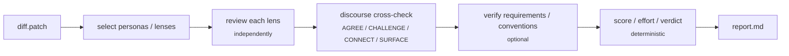
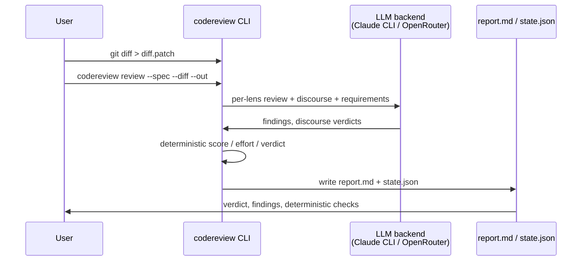
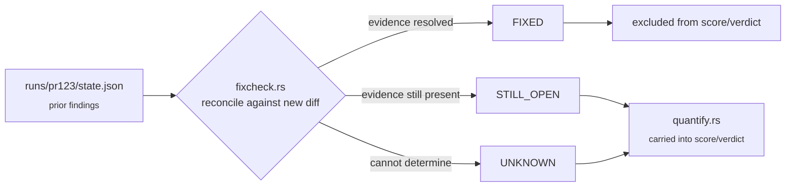
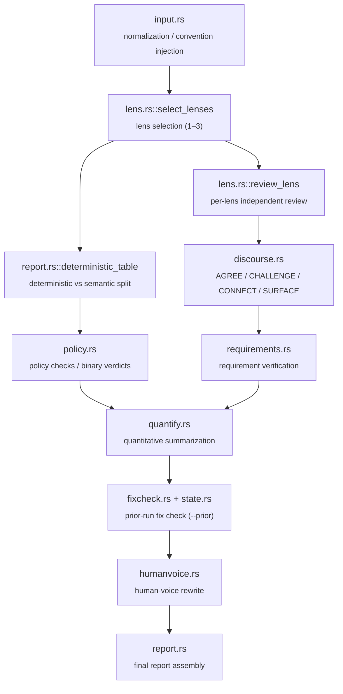
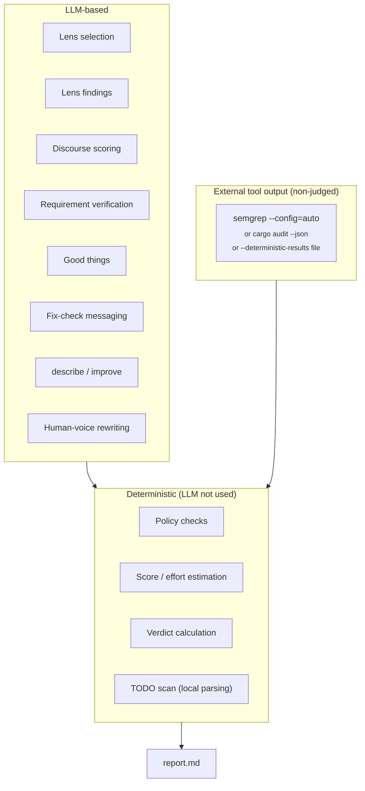
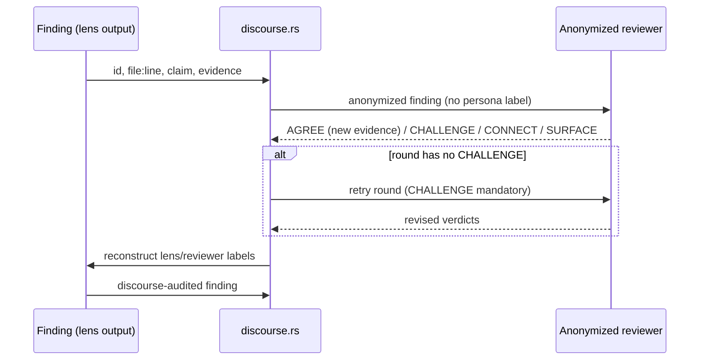

# Code-Review-Loop

A deterministic-first, persona-based review CLI for PR diffs, written in Rust.

`Code-Review-Loop` runs each PR diff through a structured pipeline: multiple expert
personas review the diff independently, cross-check each other's findings through
an anonymized discourse round, and a local deterministic layer — not the LLM —
computes the final score, effort estimate, and pass/fail verdict.

Default LLM backend is Claude Code CLI (`claude -p --output-format json`); an
OpenRouter backend (`--backend openrouter` + `OPENROUTER_API_KEY`) is also available
and does not require the `claude` CLI. A third backend, `--backend custom` (#156),
targets any other OpenAI-compatible chat completions endpoint — a self-hosted
vLLM/Ollama instance, or an internal gateway — via `--base-url` and `--model` (both
required; there's no universal default model for an arbitrary endpoint). An optional
`CODEREVIEW_API_KEY` env var is sent as a bearer token if set; many self-hosted
endpoints don't require one, so it's fine to leave unset.

## Quick start

```bash
cargo build --release
git diff > diff.patch
./target/release/codereview review --spec specs/default.toml --diff diff.patch --out runs/
```

Or grab a prebuilt binary (macOS/Linux) from [Releases](../../releases) once a tagged
release exists — see [CHANGELOG.md](CHANGELOG.md) for what's changed between releases.

Two things worth knowing before your first real run:

- ⚠ the diff (and any `--requirements`/`--conventions` content) is sent verbatim to the
  configured LLM provider, with no secret/PII redaction — see
  [Limits and known caveats](#limits-and-known-caveats).
- ⚠ don't wire `verdict` into a blocking/auto-merge CI check — see
  [Recommended CI integration](#recommended-ci-integration).

The rest of this README covers the pipeline, every flag, and the full list of caveats in
more detail.

## Pipeline overview



## What this repository is for

This CLI is designed for PR-level review and post-review remediation checks.

- `review` : full PR pipeline (primary mode)
- `describe` : generate PR summary metadata (`title`, `summary`, walkthrough, labels)
- `improve` : produce concrete patch suggestions with before/after code snippets

It favors traceability and auditability:

- deterministic checks are locally computed,
- LLM output is limited to judgmental parts, and
- fixed schemas keep outputs reviewable by scripts.

## Build and requirements

### Requirements

- Rust toolchain (for building the CLI)
- `claude` CLI in PATH (for LLM-backed review modes, default backend) —
  or `--backend openrouter` with `OPENROUTER_API_KEY` set, which needs no `claude` CLI
- optional: `semgrep` for local deterministic SAST/secrets/semi-static checks
- optional: `cargo-audit` (`cargo install cargo-audit`) for local deterministic dependency
  vulnerability checks

### Build

```bash
cargo build --release

# Built binary:
# target/release/codereview
```

If you want to keep a local debug binary:

```bash
cargo build
```

## Core usage

All commands expect a diff patch and a spec file.

```bash
git diff > diff.patch
```

### `review` (primary pipeline)

```bash
codereview review \
  --spec specs/default.toml \
  --diff diff.patch \
  --requirements requirements.md \
  --conventions conventions.md \
  --deterministic-results deterministic-results.json \
  --human-voice \
  --lang Korean \
  --out runs/pr123
```

`requirements`, `conventions`, and `deterministic-results` are optional.
If omitted, the tool emits explicit "not provided" sections rather than inventing assumptions.

`--lang` controls only the language of LLM-generated text (claims, evidence, reasoning,
descriptions, suggestions) — accepts any language name (`Korean`, `Japanese`, `Russian`, ...).
report.md's own structural labels (headers, table columns, `Verdict:`/`Score:`) always stay
in English. Omit it for English output (the default). Also available on `describe`/`improve`.



Output (normally under `runs/pr123`):

- `report.md`: verdict, policy checks, quantitative summary, requirements/conventions,
  findings, good things, deterministic checks, and discourse audit
- `state.json`: review state snapshot used by `--prior`
- `manifest.json`: per-run metadata for after-the-fact debugging — codereview version,
  model/cheap-model, spec name/path/hash, round, selected lenses, successful-lens count, stage
  errors/warnings, files dropped from the diff due to the size cap, and the LLM usage summary.
  Best-effort — a failure to write it doesn't fail the run, since report.md/state.json have
  already landed by that point.

### `--prior` (re-review after patching)

```bash
git diff > diff2.patch
codereview review \
  --spec specs/default.toml \
  --diff diff2.patch \
  --out runs/pr123-r2 \
  --prior runs/pr123
```

When prior state exists, confirmed findings from the previous run are reconciled as
`FIXED`, `STILL_OPEN`, or `UNKNOWN`. Only `STILL_OPEN` findings continue to be carried
into the current score/verdict logic.



### `describe`

```bash
codereview describe \
  --spec specs/default.toml \
  --diff diff.patch \
  --out runs/pr123
```

Produces `describe.md` with:

- title
- short summary
- walkthrough
- suggested labels
- `can_be_split`
- TODO/FIXME/XXX scan flags (from local deterministic checks)

### `improve`

```bash
codereview improve \
  --spec specs/default.toml \
  --diff diff.patch \
  --out runs/pr123
```

Produces concrete before/after snippets in `improve.md` for each review claim.

## Persona-based lens pipeline

`specs/default.toml` defines lens names, personas, and tones.

Default personas include:

- Martin Fowler (Design)
- John Ousterhout (Complexity)
- Kent Beck (Tests)
- Sandi Metz (Naming)
- Kent C. Dodds (Style)
- Vladimir Khorikov (Consistency)
- Rich Hickey (Context)

Additional personas can be defined via `persona_name`, `persona_voice`, and `tier` in
`src/spec.rs` config structures and TOML settings.

## Real-world validation

The obvious question about a persona+discourse pipeline is whether it beats a single reviewer, or
is just theater around one model asked the same thing several times. Answered with real
measurements, not benchmarked in the abstract — every number below is from an actual
`--backend openrouter` run against a real model, reviewing real diffs pulled from an unrelated
production codebase's own git history (ground truth via [SZZ](https://en.wikipedia.org/wiki/SZZ_algorithm):
`git blame`-traced bug-introducing commits, not hand-picked or self-labeled). Full methodology,
every raw number, and everything that went wrong along the way: [`evals/README.md`](evals/README.md)
and [`evals/reports/`](evals/reports/).

| | Full pipeline | Single-lens baseline | Self-consistency (3 passes, best case) |
|---|---|---|---|
| Recall (n=78) | **0.816** | 0.395 | — |
| Recall (n=41) | 0.792 | 0.375 | 0.667 |
| Precision | 0.53–0.63 | 0.56–0.64 | 0.640 |
| Cost per diff | ~$0.0035–0.0039 / 5.8–5.9 calls | ~$0.0012–0.0015 / 1.7–1.8 calls | ~$0.0039 / 5.4 calls |

**Recall roughly doubles with the full pipeline, independently confirmed at two sample sizes,
while precision stays comparable between configs** — the extra findings aren't disproportionately
noise. The more important result: **self-consistency (running the single-lens config 3 independent
times and taking a majority or union vote) does not recover this advantage, even at the same real
cost.** The best self-consistency variant tops out at 0.667 recall against the full pipeline's
0.792; requiring majority agreement is actually *worse* than one pass (0.292), a real consequence
of each pass independently catching a given defect under 50% of the time. This is evidence the
architecture — persona diversity plus one round of anonymous discourse — is doing real work, not
just spending more tokens per diff.

Also measured, not assumed: whether discourse's self-reported confidence (`high`/`medium`/`low`)
predicts whether a finding is actually correct. Checked twice against real ground truth (not
self-graded) — confidence tiers are only weakly distinguishable, and an early "medium beats high"
result at a smaller sample size did not replicate at a larger one. **Don't trust a single
high-confidence claim over a medium one without independent verification.**

Total real spend behind these numbers so far: **$0.97 across 428 review runs (1,496 LLM calls)**.
None of this is a finished verdict on the architecture — see `evals/README.md`'s own caveats
(sample sizes, one repo, one spec, methodology limits) — but it's real, measured evidence in place
of the pure speculation this section used to be.

**Generalization and non-determinism, also measured, not assumed:**

| | This repo (n=78, mobile app) | A second repo (n=34, this project's own Rust codebase) |
|---|---|---|
| Recall | 0.816 | **0.444** |
| Precision | 0.53–0.63 | **0.222** |

The drop is real, not noise: both repos share the same dominant miss pattern (a missed defect
almost always has `verdict_reason=policy_failure` — no lens/discourse round ever proposed a
matching finding at all), seen independently in two different languages/domains. A same-diff
repeat run (12 cases, identical spec/diff/model) found the underlying scoring itself is noisy on
top of that: **6/12 (50%) flipped catch/miss between two independent runs of the exact same
diff.** Full detail: [`evals/reports/2026-08-08-cross-repo/summary.md`](evals/reports/2026-08-08-cross-repo/summary.md).

### Path to production

The numbers above answer "does the architecture help" — not "is this ready to gate merges." It
isn't, yet. Updated against what's now real vs. still open:

1. **Close the precision/recall gap — still open.** Recall 0.44–0.82 / precision 0.22–0.63 (both
   repos) is too weak and too variable for a blocking gate. Root-cause is now real, not
   speculative: the dominant miss pattern in both repos is a `policy_failure`-only verdict with
   zero confirmed findings proposed — the gap is in lens/discourse coverage, not in
   `vote_threshold` tuning (see [Precision/recall operating points](#precisionrecall-operating-points)):
   in the cross-repo benchmark's own confirmed findings (now logged per-finding via
   `discourse/mod.rs`'s vote-net instrumentation), CONFIRMED outcomes clustered at either exactly
   the 0.6 default threshold or a full 1.0, with little middle ground — retuning the threshold has
   limited room to help with cases where no finding was ever proposed in the first place.
2. **Fix or drop the confidence signal — partially done.** `report.md` itself now carries an
   inline caveat next to every discourse confidence value (previously this warning only lived in
   this README, invisible to someone reading a single PR's report). The underlying weak
   correlation is unchanged — finding-level ground truth calibration (the open half of #163) or a
   different mechanism (e.g. stricter citation verification) is still unbuilt.
3. **Widen validation scope — measured, and the answer is bad news.** A second SZZ benchmark
   against a different repo/language (this project's own Rust codebase, table above) shows the
   numbers do *not* transfer: recall and precision both roughly halve or worse. This makes the
   "not prod-ready" conclusion stronger, not weaker — treat the 78-case numbers as an upper bound
   specific to that repo/spec, not a general expectation.
4. **Handle non-determinism — measured, and it's severe.** A same-diff repeat run found a 50%
   catch/miss flip rate (above). A `--temperature` flag now exists (`--temperature 0.0`–`1.0` on
   `review`) to trade review nuance for reproducibility, but whether a low value actually reduces
   the flip rate is a separate, still-open measurement — the 50% figure was measured at the
   provider's default (unset) temperature.
5. **Close known security gaps — done.** `[security].denied_path_patterns` (spec-configurable)
   excludes matching files' diff content before anything touches it, not just before the LLM call
   — excluded files are logged in `manifest.json`'s `denied_files` as an audit trail.
   `secretscan.rs` now also flags Luhn-valid payment-card-shaped digit runs, not just
   credential-shaped patterns. Broader PII (emails, phone numbers, national IDs) is deliberately
   not attempted — line-by-line pattern matching can't tell legitimate contact info in source from
   real leaked user data without more context than this scan has.
6. **Shadow mode before any gate — done.** `codereview review`'s exit code has never reflected
   `verdict` by default (it's always been shadow mode, whether or not that was documented as
   deliberate) — `--fail-on {comment,needs-context,request-changes}` is now the explicit opt-in
   for a team that's ready to gate on it; the default (`never`) is unchanged.

Items 1 and 2 remain open, and item 3's answer makes the overall picture worse, not better — treat
`codereview` as advisory only. See [Recommended CI integration](#recommended-ci-integration).

## Precision/recall operating points

Discourse's confirmation bar (`[discourse].vote_threshold` in a spec, default `0.6`) controls how
easily a finding gets `CONFIRMED` from its confidence-weighted vote tally — lower catches more
real defects at the cost of more false positives, higher does the reverse. Three starting points,
in `specs/`:

- `specs/default.toml` — the balanced default (`vote_threshold = 0.6`).
- `specs/high-recall.toml` — lower bar (`0.35`); use when missing a real bug costs more than an
  extra false positive.
- `specs/low-noise.toml` — higher bar (`1.0`); use for high-volume review queues where noisy
  findings get ignored wholesale.

The high-recall/low-noise numbers are principled starting points (threshold math against the
`confidence_weight` scale — see `discourse/votes.rs`), not independently re-measured operating
points — only the default's precision/recall (0.633/0.792) has been checked against a real
benchmark (`evals/README.md`). Measure a preset against your own repo before trusting it there.

## Command architecture and mapping

The implementation is a 12-step pipeline; the most important modules are:

| Stage | Module |
|---|---|
| Input normalization / convention injection | `input.rs` |
| Lens selection (1–3) | `lens.rs::select_lenses` |
| Deterministic vs semantic split | `report.rs::deterministic_table` |
| Policy checks and binary verdicts | `policy.rs` |
| Per-lens independent review | `lens.rs::review_lens` |
| Discourse debate (AGREE/CHALLENGE/CONNECT/SURFACE) | `discourse.rs` |
| Requirement verification | `requirements.rs` |
| Quantitative summarization | `quantify.rs` |
| Prior-run fix check (`--prior`) | `fixcheck.rs` + `state.rs` |
| Human-voice rewrite | `humanvoice.rs` |
| Final report assembly | `report.rs` |

`describe`/`improve` are separate single-call workflows and do not run the 12-step review pipeline.



## Determinism and LLM judgment boundary

### Local/deterministic (LLM not used)

- policy checks
- score and effort estimation
- verdict calculation
- TODO scan from local parsing

### LLM-based

- lens selection
- lens findings
- discourse scoring
- requirement verification
- good things
- fix check messaging
- `describe` / `improve`
- human-voice rewriting

### External tool output (non-judged)

`--deterministic-results` expects the tool's own per-check JSON shape — a flat JSON object whose
values are each an object with a `status` field:

```json
{ "<check_id>": { "status": "pass" | "fail" | "error", "evidence": "..." }, ... }
```

Any top-level key name is accepted (not restricted to a fixed set) — `quantify::deterministic_gate`
only reads `status` off each entry, keyed by the ids in `spec.deterministic_checks` (e.g. `sast`,
`secrets`, `dependency_sca`). A single `"fail"` anywhere forces `REQUEST_CHANGES` immediately; an
`"error"` (with no `"fail"` present) forces `NEEDS_CONTEXT`; this is **not raw tool output** —
`semgrep --json` and `cargo audit --json` each have their own top-level shape
(`results`/`errors`/`paths` for semgrep, `vulnerabilities`/`warnings` for cargo-audit) and will
silently read back as `NOT_RUN` for every check if passed through directly instead of translated
into the shape above.

If not provided, Code-Review-Loop auto-runs whichever of these is available on `PATH`, in the
background, concurrently with lens review — neither blocks the other:

- `semgrep --config=auto` — fills `sast`/secret-like checks
- `cargo audit --json` — fills `dependency_sca`

Results from both are merged by key, not overwritten by whichever finishes second. SCA/taint/
deprecation checks outside what these two cover remain `NOT_RUN` unless supplied externally. Those
results are presented as-is and are **not re-decided by LLM**.

**Worked example — move a mechanically-checkable claim out of LLM judgment.** A lens/discourse
finding might claim "this `dispose()` doesn't cancel the `StreamSubscription` it created." That's
not a judgment call — it's a fact a program can check (does the file contain both a subscription
assignment and a matching `.cancel()` call). Wire a project-specific script or semgrep rule for
exactly that pattern, feed its result through `--deterministic-results` under a custom check id
(e.g. `subscription_cleanup`) added to `spec.deterministic_checks`, and it's presented as-is —
not something an LLM discourse round can second-guess or contradict itself on later. See
[Recommended CI integration](#recommended-ci-integration) for why this matters in practice.



### Anonymous discourse mode

`discourse.rs` strips reviewer identity before sending findings into discourse judging:
only `id`, `file:line`, `claim`, and `evidence` are used. This reduces conformity bias
where reviewers could be influenced by persona labels. The public-facing report
reconstructs lens/reviewer labels for readability after judgment.

Enforcement rules: `AGREE` is only valid when it cites new `file:line` evidence not
already on the finding; `CHALLENGE` is mandatory at least once per round, and a round
missing it is retried once automatically (an extra LLM call).



## Performance and parallelism

- LLM call count scales roughly with:
  lens count + discourse + requirements + optional prior fix-check + optional human-voice.
- For large diffs, concurrency is configurable; the current implementation can parallelize
  lens review tasks.
- The diff is reordered before it's sent anywhere: noisy/generated file-blocks (lockfiles,
  `vendor`/`dist`/`build`/`node_modules` paths, minified assets) sort after everything else, so
  they're the first to go if the diff needs trimming. Past a 1,000,000-character hard cap, the
  lowest-priority blocks are dropped from the tail — visibly, with a warning and an in-diff note
  listing what got dropped, never silently. `report.md`'s file/line-count stats still reflect the
  full original diff regardless of what got trimmed from what's actually sent to the LLM. This
  cap is character-based, not token-based — a rough ~4-chars-per-token estimate is included in
  the large-diff warning for context, but it isn't a real per-provider/model tokenizer, so it can
  trigger too early or too late relative to the actual context window depending on the diff's
  language/content. It's also an approximate bound, not an exact one (the trailing note/join
  overhead can push the actual output a few hundred bytes past it), and it only applies to the
  diff — `--requirements`/`--conventions` content has no cap of its own; only the size *warning*
  (300k-char threshold) accounts for all three together.
- `claude -p` runtime depends on repository size and prompt density; expect seconds to
  minutes per run.

## Limits and known caveats

- the diff (plus any `--requirements`/`--conventions` content) is sent to whichever LLM
  provider is configured, verbatim — neither backend redacts secrets or PII before sending. A
  one-line warning prints to stderr on every run as a reminder; don't run this against code
  containing secrets or restricted data unless that's acceptable for your org. Before sending, a
  local pattern-based scan checks every line of the diff (added, removed, and context — not
  just added lines, since the whole diff is what's actually sent), plus `--requirements`/
  `--conventions` content, for things that look like credentials (AWS/GitHub/Slack tokens, PEM private keys,
  JWTs, `.env`-style secret assignments) and refuses
  to proceed if it finds one — pass `--allow-sensitive-input` to send it anyway. This is a
  best-effort heuristic scan, not a real secret scanner (no entropy analysis, no provider-specific
  formats beyond the ones listed) — it catches the obvious cases, not everything. Scope boundary,
  spelled out since "no redaction" undersells how narrow this is: it is credential-*pattern*
  matching (plus a Luhn-validated check for payment-card-shaped digit runs) only, not general PII
  detection (no names/emails/phone numbers/addresses/government IDs). A real path denylist does
  exist — `[security].denied_path_patterns` in a spec excludes matching files' diff content
  before anything else touches it (fails closed, not open, if a diff's header form makes a path
  unresolvable — see `input::strip_denied_paths`), and excluded files are logged in
  `manifest.json`'s `denied_files` as an audit trail of what was kept back. What's still missing:
  an audit log of what was actually transmitted to which provider for the files that *were* sent,
  and any data-residency or no-retention enforcement on the provider side — those depend on the
  provider you point `--backend` at, not on anything this tool controls.
- heuristic-only policy signals for behavior vs surface changes can produce false
  positives depending on project structure. The default spec's test/doc policy is presence-only
  (some test/doc file appears anywhere in the diff, not mapped per changed file) and strict
  enough that even this project's own "clean diff" eval fixture needed a padded test+changelog
  change to pass it — treat `specs/default.toml` as a starting point to adapt to your repo's
  conventions, not a lenient default.
- severity penalties are heuristic defaults (P0: 25, P1: 12, P2: 5, P3: 1) — configurable per
  spec via an optional `[scoring]` table (`p0`/`p1`/`p2`/`p3`); unset fields keep their default,
  so a partial table only overrides what it mentions. Effort/time budgets (`quantify.rs`'s
  `effort_and_time`) are still hardcoded — there's no config field for those yet.
- fixed persona mapping (e.g., design→Fowler) is customizable but opinionated. Every lens, the
  discourse pass, and the judge draw from the same underlying model by default — differentiated
  only by system prompt, not genuinely different models. A `model` field on a `[[lenses]]` entry
  in spec.toml overrides `--model`/`--cheap-model` for just that lens (works with
  `--backend openrouter`/`custom`) if you want to test heterogeneous models directly. **This used
  to be pure speculation about whether that mattered — it's now measured**: see
  [Real-world validation](#real-world-validation). Running the same single-lens config 3
  independent times (the closest same-model analogue) does *not* reproduce the full pipeline's
  recall even at matched cost, which is evidence persona diversity + discourse cross-verification
  is contributing something beyond "the same model asked more than once" — not proof every
  possible failure mode is independent, but a real answer where there used to be none.
- `--prior` assumes compatible finding identity across re-runs with the same spec.
- repository-independent claim matching can become noisy when file renames are common
  without supporting heuristics.
- LLM judgment can be wrong in either direction — it can miss a real issue, and it can also
  assert something false with high confidence (e.g. claiming code is absent from a diff when it's
  actually present). Neither failure mode is fully eliminated by the deterministic scoring layer,
  since that layer's inputs (finding existence, severity) still come from the LLM. See
  [Recommended CI integration](#recommended-ci-integration). Discourse's own self-reported
  confidence is measured to be only weakly correlated with actual correctness (see
  [Real-world validation](#real-world-validation)) — lean on non-LLM checks
  (`--deterministic-results`/semgrep/compile/tests) for anything mechanically checkable instead of
  trusting a high-confidence claim at face value.

## Recommended CI integration

Don't wire `verdict` into a required/blocking CI check that auto-merges or auto-rejects PRs
without a human reading the report first. Treat `report.md` as an informational PR comment/artifact
that helps a reviewer prioritize what to look at (start with `P0`/`P1` findings), not as a
replacement for their judgment:

- Post the report as a PR comment or check-run **annotation**, not a required status check that
  blocks merge on its own. `codereview review`'s process exit code has never reflected `verdict`
  by default — it exits 0 on any successful run regardless of what it found, so wiring it into CI
  at all already means shadow mode unless you opt in. `--fail-on {comment,needs-context,
  request-changes}` is that explicit opt-in, for a team that's run in shadow mode long enough to
  trust gating on it (see [Path to production](#path-to-production)'s step 6). Default
  (`--fail-on never`) keeps today's non-blocking behavior unchanged.
- Findings that assert something is *absent* from the diff (`"not in the diff"`,
  `"not present"`, `"missing"`) are the most failure-prone category — discourse now has the actual
  diff to verify these against (previously it didn't; see `src/discourse/mod.rs`'s `ctx` handling),
  but an LLM can still be confidently wrong. Spot-check high-impact absence claims against the diff
  before acting on them.
- A `P0`/`P1` finding that discourse couldn't reach consensus on (`UNCERTAIN` — see the "Needs
  Human Review" section of `report.md`) forces `verdict` to `NEEDS_CONTEXT` rather than letting it
  fall through to `APPROVE`/`COMMENT` — but this only covers `UNCERTAIN` specifically; still read
  the "Needs Human Review" section yourself, since `MERGED`/omitted entries there aren't reflected
  in the verdict at all.
- Move whatever you can out of LLM judgment and into `--deterministic-results` (see the worked
  example above) — anything mechanically checkable shouldn't be left for the LLM to assert and
  potentially contradict itself on across discourse rounds.
- Before trusting `verdict` for any kind of gating, measure its actual precision/recall against a
  golden set of known-good/known-bad diffs for *your* codebase — don't assume the numbers in
  [Real-world validation](#real-world-validation) (recall 0.79–0.82, precision 0.53–0.63,
  measured on one repo/one spec) transfer as-is; see `evals/` for the same methodology applied
  here.

## Governance and internal docs

Repository governance is documented in:

- [Commit/PR guide](docs/organization/README.md)
- [Public sync mapping](docs/organization/public-sync-mapping.md)
- [Research and evidence notes](docs/organization/research-and-evidence-survey-2026-07-29.md)

If you change behavior, scoring, or reporting schema, update the governance docs and
the corresponding tests/scripts together.

## Relationship to `review-panel`/`full-review`

The following items are intentionally out of scope for this repository:

- **Self-verification workflow** (apply patch + rerun tests): requires isolated
  checkout orchestration in this CLI layer.
- **Review memory / repeated-pattern learning**: CLI runs per invocation and does not
  persist reviewer memory by default.

These are explicitly tracked in the sibling ecosystems where stateful agent-side
execution is available.

## Contribution notes

- Use the repository governance docs before opening PRs.
- Keep command behavior changes in one PR scope.
- Include validation commands and sample outputs when changing output schema.
- For any change in quantitative definitions, update tests/docs together.
